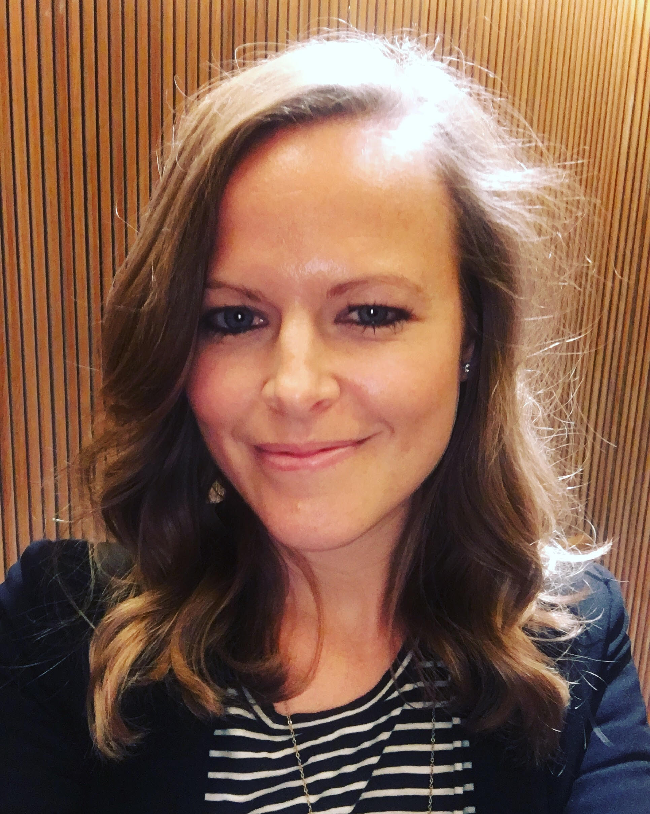
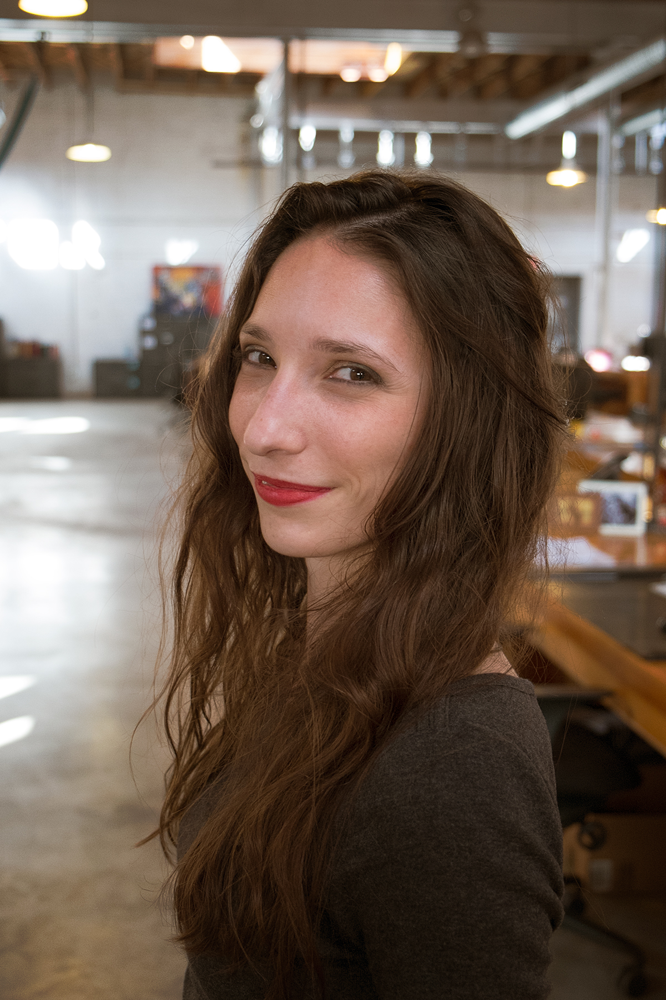
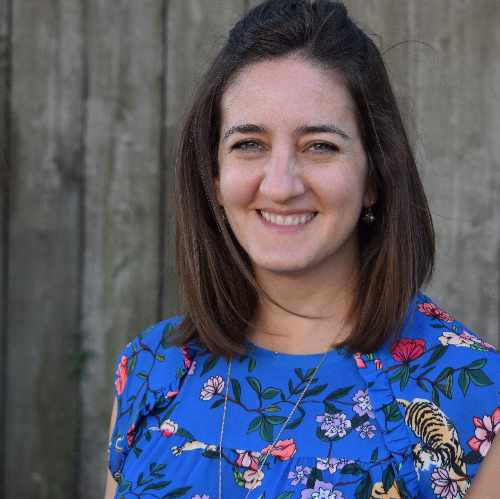
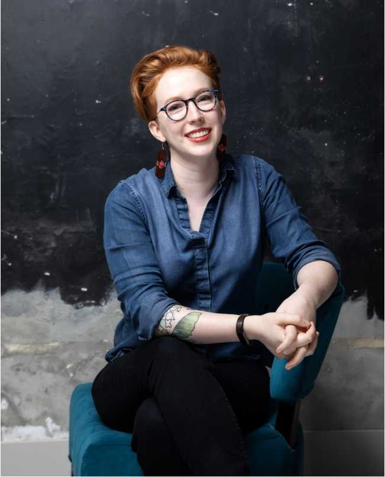
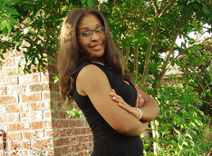

# IWD New Orleans 2019 Speakers
Speakers for our [International Women's Day celebration](https://www.meetup.com/gdg-new-orleans/events/258679259/) presented by Women Techmakers and powered by GDG New Orleans

## Leadership Panel

**Adele Tiblier**

**Lindsay Fox** is the VP of Sales & Brand Strategy at LookFar Labs, where she helped to create the brand, culture, sales and marketing strategies, and business processes that are the foundation of LookFar Labs. She is responsible for identifying clients, defining strategies to reach them, and determining the right services to sell to them.

Having a background in digital media management helped her transition to software development, while having co-founded a digital dailies lab and directed and produced a documentary fueled her passion for working with entrepreneurs. She moved from Los Angeles to New Orleans a little over five years ago and is thrilled to be a contributor of the burgeoning tech and startup community here. Find Lindsay on [LinkedIn](https://www.linkedin.com/in/lindsay-fox-5945426/) and [Twitter](https://twitter.com/lfox3).

**Alsie Dunbar**

**Katie Delgado**

## How UX Affects Reality

**Danielle Matherne** first found her way into the tech world at 10 years old when she accidentally purchased an HTML book. After honing her creative design and development capabilities in advertising, Danielle now serves as Director of Digital at FACTOR 10, a tech-forward, holistic business design firm. She enjoys talking nerdy about strategy, design, and code; bridging the communication gap between visual artists and techies; and sipping Irish whiskey, neat.

## Actions on Google Workshop &amp; Code Lab

**Olivia Sabo-Rush**

## #IAmRemarkable Workshop

**Sia Karamalegos** is a developer, international conference speaker, and writer. She is a Google Developer Expert in Web Technologies and a Women Techmakers ambassador. She co-organizes #FrontEndParty, GDG New Orleans, and NOLA Hack Night in the New Orleans area. She is the founder and lead developer for Clio + Calliope Web Development and was recognized in the Silicon Bayou 100, the 100 most influential and active people in tech and entrepreneurship in Louisiana. When she's not coding, speaking, or consulting, Sia likes to design crochet patterns and dabble in charcoal figure drawing. She's also an avid endurance athlete. Find Sia on [her website](https://siakaramalegos.github.io/), [Twitter](https://twitter.com/thegreengreek), [Medium](https://medium.com/@thegreengreek), and [LinkedIn](https://www.linkedin.com/in/karamalegos).

## Mentoring and Support Panel

**Glynnis Ritchie** has over seven years of professional experience in interface design, user research, and creating consistent, accessible user experiences. Previously, she led design on a component library and design system for internal tools at Rackspace. Glynnis has served on small teams at start-ups and non-profits, and on large, enterprise teams. She's passionate about creative collaboration and the spaces where elegant code and delightful experiences overlap. When she's not working, Glynnis cultivates analog hobbies away from the screen. People also know her know as a calligrapher, tea connoisseur, and ceramicist. Find Glynnis on [Twitter](https://twitter.com/glynnisritchie)

**Carla Buckner** is an experienced Software Quality Assurance Engineer with a demonstrated history of working in various industries that include mobile telecommunications, pharmaceuticals, oil, energy, & gas, and human resources. Obtaining her Master of Science in Computer Science in December 2018, she has built a reputable background in robotics research, is active in implementing STEM diversity initiatives, and is devoted to improving her community in every way that she can. She currently resides in Baton Rouge, LA with her fiancé--Athan, two children--Iyanna (daughter) and Imari (son), and two dogs. Find Carla on [LinkedIn](www.linkedin.com/in/carla-buckner-46075154).

As designer and developer of 10+ years, **Lynsey Gwin** is a problem-solver who executes with efficiency and empathy. She serves as a consultant to the client and advocate for the consumer. Her professional passion is working with clients to discover the best solution for their needs and ushering them through the execution of their direction. Find Lynsey on [Twitter](https://twitter.com/lynseydesign).

**Katie Patch Harris** is a software engineer at CotingaSoft, a local software engineering company. She specializes in both web and mobile development, with a particular passion for iOS. Prior to CotingaSoft Katie had a career in the arts with experience in designing and installing store displays, gallery direction, and as an assistant artist. She has a BFA in illustration from Rhode Island School of Design.

**Elan Jones**
