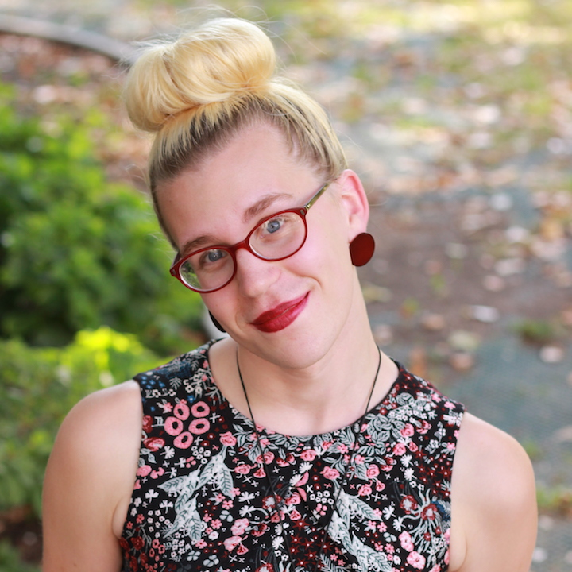
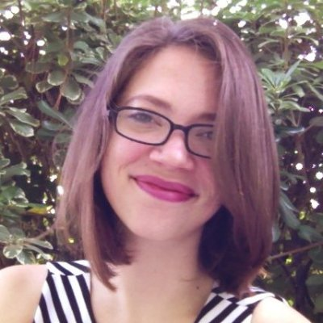

# IWD New Orleans 2019 Speakers
Speakers for our [International Women's Day celebration](https://www.meetup.com/gdg-new-orleans/events/258679259/) presented by Women Techmakers and powered by GDG New Orleans

## Leadership Panel

### Adele Tiblier, panel facilitator

**Adele Tiblier** is the Chief Marketing Officer of Story Block Media and a New Orleans native. She is a veteran marketer living in a world of acronyms (SEO, SEM, SMO, CRM, ROI, CLV, ROAS, etc). Adele brings an extensive background in search engine optimization, online marketing and promotion from over a decade of experience in the Internet industry. Her knowledge and expertise of online marketing has served the tourism, technology, retail and nonprofit sectors, among others. Find Adele on [LinkedIn](https://www.linkedin.com/in/adeletiblier/) and [Twitter](https://twitter.com/adeletiblier?lang=en).

### Lindsay Fox, panelist

**Lindsay Fox** is the VP of Sales & Brand Strategy at LookFar Labs, where she helped to create the brand, culture, sales and marketing strategies, and business processes that are the foundation of LookFar Labs. She is responsible for identifying clients, defining strategies to reach them, and determining the right services to sell to them.

Having a background in digital media management helped her transition to software development, while having co-founded a digital dailies lab and directed and produced a documentary fueled her passion for working with entrepreneurs. She moved from Los Angeles to New Orleans a little over five years ago and is thrilled to be a contributor of the burgeoning tech and startup community here. Find Lindsay on [LinkedIn](https://www.linkedin.com/in/lindsay-fox-5945426/) and [Twitter](https://twitter.com/lfox3).

### Alsie Dunbar, panelist

With 19 years heavily vested in the chemical industry, **Alsie Dunbar** used her personal experience from her professional career as a senior scientist and process engineer as the precept for the blueprint in forming The STEMS GEMS Mentoring Project which highlights Girls Excelling in Math and Science. Dunbar formed STEM GEMS in 2013 and has mentored over 650 girls in conjunction with the Ascension Parish School Board successfully with six participants receiving Student of the Year distinctions. Through the STEM GEMS Mentoring Project, Dunbar promotes the interest of Girls Excelling in Math and Science through mentoring and encouraging them to pursue careers and advanced degrees in STEM majors where women and minorities are underrepresented.

### Katie Delgado, panelist

<!--  -->

**Katie Delgado** began her professional career as a UX’er but realized she was much better at code. She worked for ten years as a front-end developer before being promoted to management within a year of joining GE due to her balance of soft and hard skills. The following year, she went from technical anchor for 1 team, to manager in charge of hiring two new teams, to Sr Manager over the most successful product within GE overseeing 8 teams and their managers.

## Pushing UX Beyond Pixels: How User Experience Shapes Reality

### Danielle Matherne, speaker

**Danielle Matherne** first found her way into the tech world at 10 years old when she accidentally purchased an HTML book. After honing her creative design and development capabilities in advertising, Danielle now serves as Director of Digital at FACTOR 10, a tech-forward, holistic business design firm. She enjoys talking nerdy about strategy, design, and code; bridging the communication gap between visual artists and techies; and sipping Irish whiskey, neat.

## Actions on Google Workshop &amp; Code Lab

### Olivia Sabo-Rush, workshop leader

**Olivia Sabo-Rush**  started teaching herself web design over ten years ago, working late into the night to learn more and perfect her new creations. After pursuing a dance career that led her to perform in Russia, South Korea, and Germany, she finally followed her long sleeping passion for engineering. Liv brings the artistry she found dancing to her software development, creating beauty both on the screen and in her code. Even now she still finds herself working through the night, dancing across her keyboard.

Liv received her Bachelor of Fine Arts in Dance from California Institute of the Arts, and is a graduate of Operation Spark's Immersion program. She is currently a senior developer at iSeatz. Outside work Liv loves to attend ballet or contemporary dance classes, bike, or work on personal software / design projects.

## #IamRemarkable Workshop

### Sia Karamalegos, workshop leader

**Sia Karamalegos** is a developer, international conference speaker, and writer. She is a Google Developer Expert in Web Technologies and a Women Techmakers ambassador. She co-organizes #FrontEndParty, GDG New Orleans, and NOLA Hack Night in the New Orleans area. She is the founder and lead developer for Clio + Calliope Web Development and was recognized in the Silicon Bayou 100, the 100 most influential and active people in tech and entrepreneurship in Louisiana. When she's not coding, speaking, or consulting, Sia likes to design crochet patterns and dabble in charcoal figure drawing. She's also an avid endurance athlete. Find Sia on [her website](https://siakaramalegos.github.io/), [Twitter](https://twitter.com/thegreengreek), [Medium](https://medium.com/@thegreengreek), and [LinkedIn](https://www.linkedin.com/in/karamalegos).

## Mentoring and Support Panel

### Glynnis Ritchie, panel facilitator

**Glynnis Ritchie** has over seven years of professional experience in interface design, user research, and creating consistent, accessible user experiences. Previously, she led design on a component library and design system for internal tools at Rackspace. Glynnis has served on small teams at start-ups and non-profits, and on large, enterprise teams. She's passionate about creative collaboration and the spaces where elegant code and delightful experiences overlap. When she's not working, Glynnis cultivates analog hobbies away from the screen. People also know her know as a calligrapher, tea connoisseur, and ceramicist. Find Glynnis on [Twitter](https://twitter.com/glynnisritchie)

### Carla Buckner, panelist

**Carla Buckner** is an experienced Software Quality Assurance Engineer with a demonstrated history of working in various industries that include mobile telecommunications, pharmaceuticals, oil, energy, & gas, and human resources. Obtaining her Master of Science in Computer Science in December 2018, she has built a reputable background in robotics research, is active in implementing STEM diversity initiatives, and is devoted to improving her community in every way that she can. She currently resides in Baton Rouge, LA with her fiancé--Athan, two children--Iyanna (daughter) and Imari (son), and two dogs. Find Carla on [LinkedIn](www.linkedin.com/in/carla-buckner-46075154).

### Lynsey Gwin, panelist

As designer and developer of 10+ years, **Lynsey Gwin** is a problem-solver who executes with efficiency and empathy. She serves as a consultant to the client and advocate for the consumer. Her professional passion is working with clients to discover the best solution for their needs and ushering them through the execution of their direction. Find Lynsey on [Twitter](https://twitter.com/lynseydesign).

### Katie Patch, panelist

**Katie Patch Harris** is a software engineer at CotingaSoft, a local software engineering company. She specializes in both web and mobile development, with a particular passion for iOS. Prior to CotingaSoft Katie had a career in the arts with experience in designing and installing store displays, gallery direction, and as an assistant artist. She has a BFA in illustration from Rhode Island School of Design.

### Élan Jones, panelist

**Élan Jones** is the executive director at NOLA_CODE and has been involved in all aspects of running NOLA_CODE, from securing funding to teaching classes and leading workshops. Ms. Jones is passionate about NOLA_CODE’s mission goals, as they align perfectly with her own efforts in community organizing. Through outreach, she has helped NOLA_CODE to team up with schools and organizations across the New Orleans area. In her free time, Élan likes to practice aerial hoop and fabrics.
